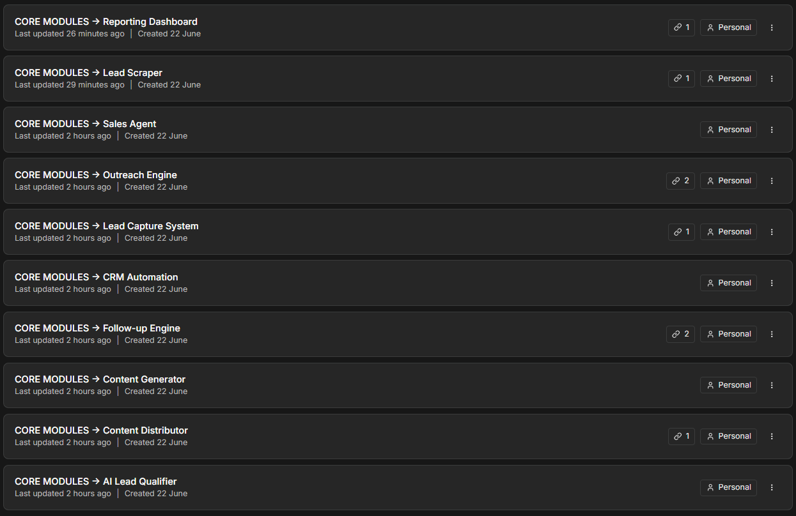
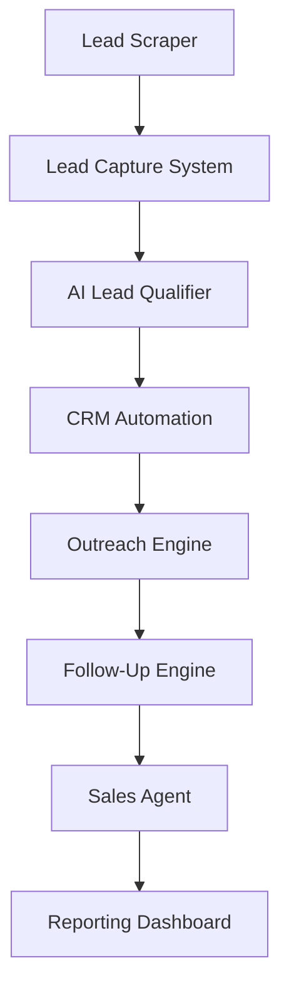
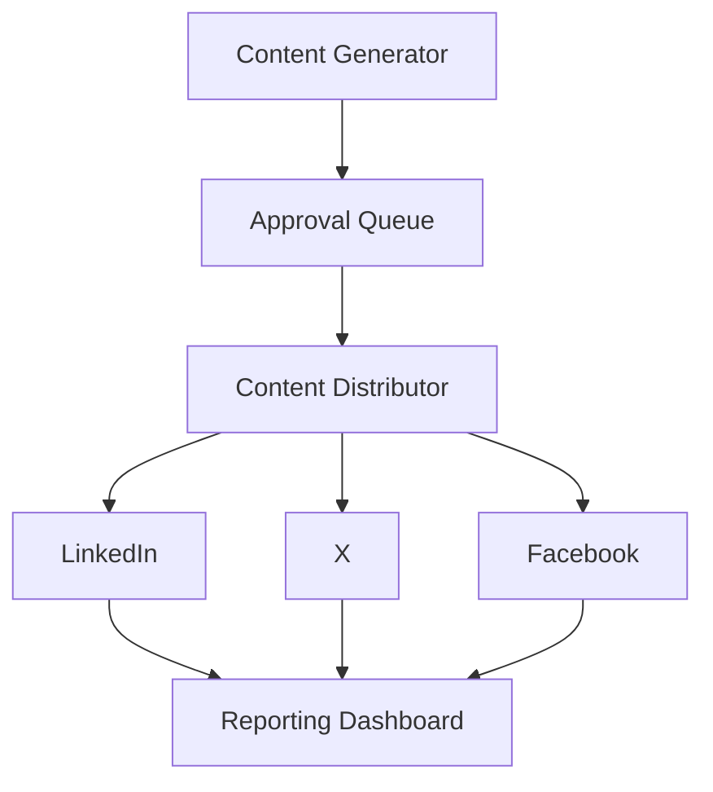

# n8n AI Automation Core Modules

A collection of 10 completed and tested n8n proof-of-concept workflows for lead generation, sales automation, CRM operations, content distribution, and business reporting.

These workflows demonstrate modular automation architecture, JavaScript data processing, conditional routing, webhook handling, API integration, Google Workspace automation, and reusable business logic.

## Core Modules

| Module                                          | Function                                                                   | Business Value                                                        |
| ----------------------------------------------- | -------------------------------------------------------------------------- | --------------------------------------------------------------------- |
| [AI Lead Qualifier](ai-lead-qualifier.json)     | Scores leads from 0 to 100 and routes them as hot, warm, or cold           | Prioritizes high-value opportunities and reduces manual qualification |
| [Lead Scraper](lead-scraper.json)               | Generates structured prospect records from configurable lead-source inputs | Accelerates prospect discovery and standardizes lead data             |
| [Lead Capture System](lead-capture-system.json) | Receives, normalizes, validates, and stores incoming leads                 | Prevents lost leads and creates consistent intake processes           |
| [Outreach Engine](outreach-engine.json)         | Creates personalized outreach, sends emails, and logs activity             | Reduces manual prospecting and improves outreach consistency          |
| [Follow-Up Engine](follow-up-engine.json)       | Identifies open opportunities and executes personalized follow-ups         | Prevents prospects from falling through the cracks                    |
| [Sales Agent](sales-agent.json)                 | Evaluates buyer intent and prepares an appropriate sales response          | Improves response speed and standardizes sales decision-making        |
| [CRM Automation](crm-automation.json)           | Processes CRM updates and routes records through defined business logic    | Reduces administrative work and improves pipeline accuracy            |
| [Content Generator](content-generator.json)     | Produces structured, platform-ready marketing content                      | Accelerates content production and improves consistency               |
| [Content Distributor](content-distributor.json) | Routes approved content across multiple distribution channels              | Reduces repetitive publishing work and supports scalable distribution |
| [Reporting Dashboard](reporting-dashboard.json) | Calculates KPIs, logs results, and prepares recurring performance reports  | Replaces manual reporting with consistent operational visibility      |

## Revenue Automation Architecture

## Content Operations Architecture

## Technical Capabilities Demonstrated

* n8n workflow architecture and orchestration
* JavaScript and JSON data transformation
* Webhook-based workflow initiation
* Conditional logic and intelligent routing
* Lead scoring and qualification
* Gmail and Google Sheets integrations
* Modular and reusable workflow design
* Data validation and normalization
* Automated sales and content operations
* KPI calculation and reporting
* Credential-safe public workflow distribution

## Import Instructions

1. Download the desired `.json` workflow file.
2. Open n8n.
3. Select **Import from File**.
4. Configure the required credentials and external resources.
5. Replace placeholder spreadsheet IDs, sheet names, email accounts, and API settings.
6. Review all node parameters and test with controlled demo data.
7. Publish only after confirming the workflow is correctly configured for your environment.

## Security

All public workflow files have been sanitized to remove:

* API keys and access tokens
* OAuth credential bindings
* Private spreadsheet IDs and URLs
* Personal email addresses
* Private ChatGPT share links
* Webhook identifiers
* Internal n8n instance, workflow, and version identifiers

Credentials and account-specific resources must be configured after import.

## Project Status

All 10 workflows are completed and tested proof-of-concept modules.

Some integrations intentionally use demo data, simulated publishing, or configurable placeholders so the workflows can be safely reviewed and adapted without exposing private credentials or production systems.

## About the Developer

Built by **Alex Maeser**, AI Automation Engineer and AI Solutions Architect at ABM Solutions.

I design AI-powered automation systems using n8n, LLMs, APIs, webhooks, JavaScript, and modern SaaS integrations.

[Automation Portfolio](https://alex-ai-automation.carrd.co/) | [LinkedIn](https://www.linkedin.com/in/alex-automation/) | [GitHub](https://github.com/Riles1975) | [Email](mailto:alex.abmsolutions@gmail.com)
